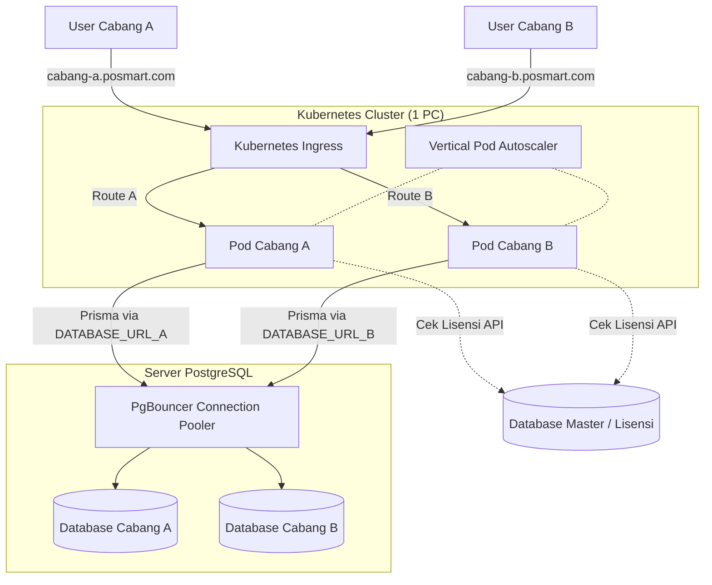

# Arsitektur Deployment Multi-Tenant POS Mart

Dokumen ini menjelaskan rancangan arsitektur untuk menjalankan banyak cabang (multi-tenant) di satu komputer fisik menggunakan teknologi Docker dan Kubernetes, menggantikan sistem copy-folder manual (`generate_cabang.bat`).

## 1. Ringkasan Arsitektur (Database-per-Tenant)

Pendekatan ini menggunakan **satu Docker Image** yang sama (satu source code), namun dijalankan berulang kali sebagai **Pod** (Container) yang berbeda di Kubernetes. Setiap Pod tidak saling mengetahui, dan masing-masing dihubungkan ke **database yang terpisah secara fisik** menggunakan *Environment Variable*.

## 2. Komponen Utama

| Komponen | Fungsi Utama |
|----------|--------------|
| **Docker** | Mengemas aplikasi menjadi 1 *Image* tunggal sehingga tidak perlu ada duplikasi folder source code. |
| **Kubernetes (K3s/MicroK8s)** | Mengatur berjalannya kontainer (Pod), memastikan aplikasi tidak mati, dan mengatur injeksi *Environment Variable* (`DATABASE_URL`). |
| **Ingress Controller** | Sebagai pintu masuk utama (Reverse Proxy) yang membagi jalur berdasarkan Subdomain (misal: `cabang1.toko.com` diarahkan ke Pod Cabang 1). |
| **PostgreSQL** | Database engine yang menyimpan ratusan database terpisah untuk masing-masing cabang. |
| **Database Master** | Satu database terpusat (terpisah dari data transaksi cabang) yang mencatat langganan, *License Key*, dan tanggal expired tiap cabang. |

## 3. Pencegahan Server Down & Manajemen Keterbatasan (Limit)

Karena puluhan/ratusan cabang di-*host* di dalam 1 PC fisik, berikut adalah panduan wajib untuk mencegah server *down*:

> [!WARNING]
> **Batas Koneksi PostgreSQL**
> PostgreSQL secara bawaan hanya mengizinkan maksimal 100 koneksi. Prisma membuat banyak koneksi sekaligus. Jika tidak ditangani, aplikasi akan menolak koneksi saat jumlah cabang bertambah.
> **Solusi:** Wajib menggunakan **PgBouncer** di depan PostgreSQL untuk mengatur antrean ratusan koneksi menjadi hanya beberapa koneksi ke database.

> [!IMPORTANT]
> **Kecepatan Penyimpanan (Disk I/O)**
> Harddisk biasa (HDD) atau SSD SATA akan hancur performanya saat menerima instruksi Tulis/Baca data dari puluhan cabang di detik yang sama.
> **Solusi:** Komputer fisik (Server) **WAJIB menggunakan SSD NVMe**.

> [!TIP]
> **Efisiensi RAM dengan VPA**
> Gunakan **VPA (Vertical Pod Autoscaler)** di Kubernetes. VPA akan secara dinamis memberikan RAM & CPU yang besar ke Pod Cabang yang sedang ramai transaksi, dan mengambil RAM dari Pod Cabang yang sedang sepi/tutup, sehingga resource 1 PC ini dimanfaatkan se-efisien mungkin.

## 4. Rencana Otomatisasi Buka Cabang Baru (Migrasi dari `.bat`)

Untuk menggantikan `generate_cabang.bat`, Anda harus membuat sebuah script pengelola (bisa menggunakan *Node.js* atau *Bash*) yang akan melakukan instruksi berurutan:

1. **Buat Database:** Script login ke Server PostgreSQL utama dan menjalankan `CREATE DATABASE db_cabang_baru;`.
2. **Setup Tabel (Migrasi):** Script menjalankan `prisma db push` atau `prisma migrate deploy` menggunakan URL spesifik database baru tersebut.
3. **Deploy ke Kubernetes:** Script mengirim instruksi ke Kubernetes (`kubectl apply` atau *Helm*) untuk membuat:
   - Pod aplikasi baru menggunakan Docker Image yang sudah ada.
   - Mengatur Environment Variable `DATABASE_URL` ke `db_cabang_baru`.
   - Membuat *Routing Ingress* agar subdomain `cabangbaru.toko.com` mengarah ke Pod tersebut.
4. **Catat Lisensi:** Menambahkan data cabang baru tersebut ke dalam **Database Master** beserta informasi *License Key*-nya.

## 5. Cara Scale-Up (Jika PC Penuh)

Kelebihan dari arsitektur *Database-per-Tenant* ini adalah ketika PC pertama sudah penuh kapasitasnya (RAM/CPU habis):
- Anda tidak perlu memodifikasi kode aplikasi.
- Cukup beli PC/Server ke-2.
- Install PostgreSQL di Server ke-2.
- Untuk cabang ke-51 dan seterusnya, Anda hanya perlu mengatur `DATABASE_URL` mereka agar mengarah ke **IP PC/Server ke-2**. Server pertama tetap melayani Cabang 1-50 tanpa gangguan.
